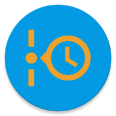
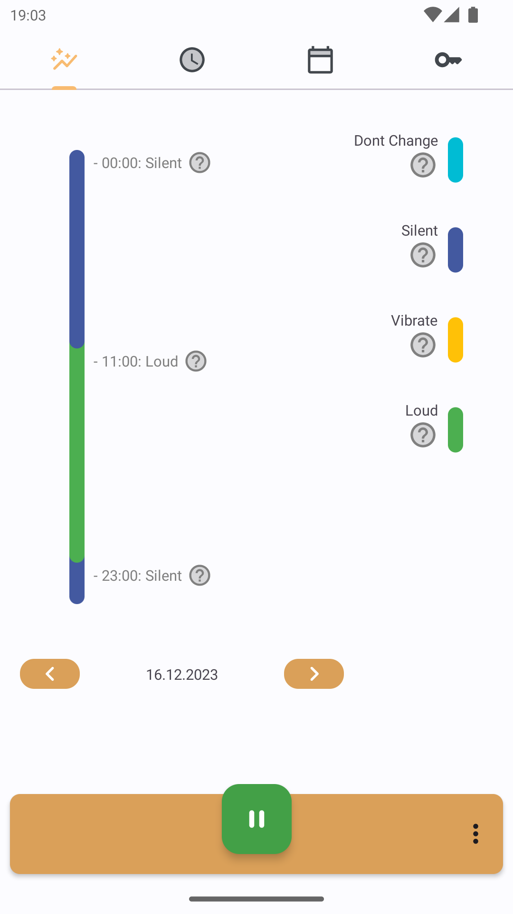
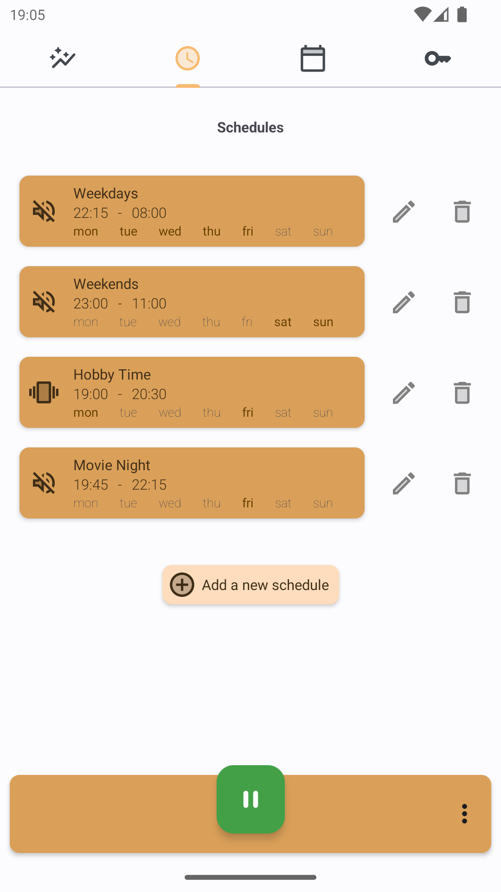
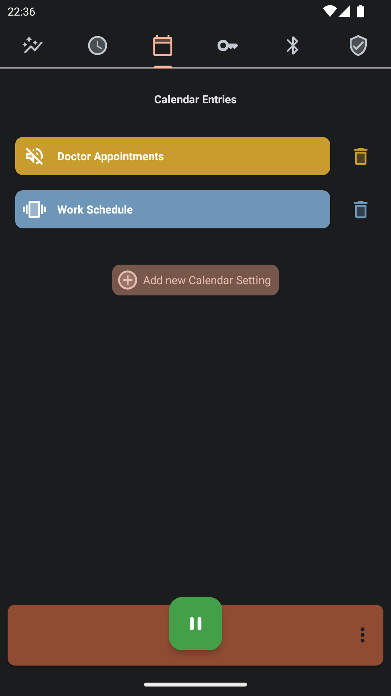
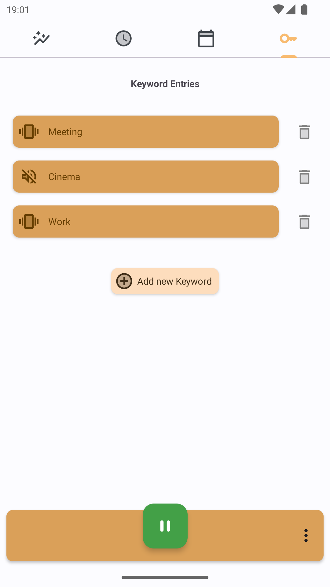
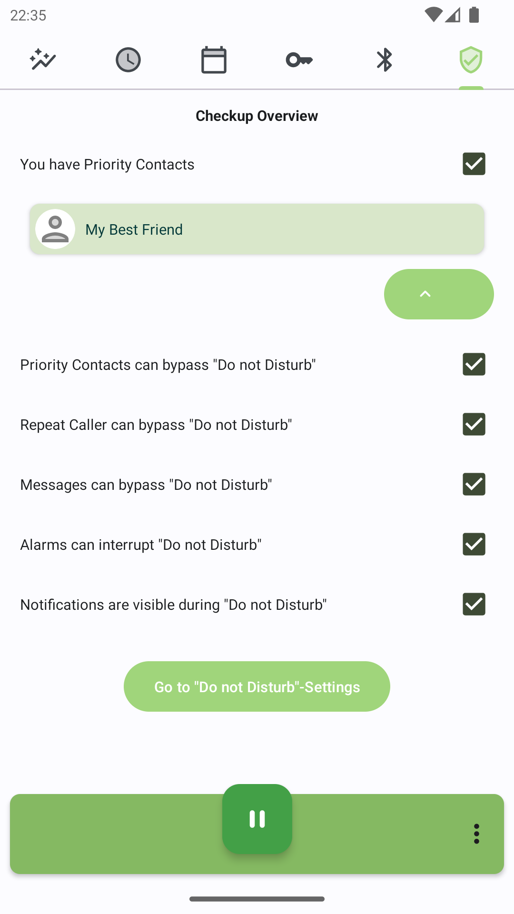

<div align="center">
<p></p>

---
# Timed Silence
### Don't let your phone rattle you!

---

[](https://github.com/newhinton/timed-silence/blob/master/LICENSE) [](https://github.com/newhinton/timed-silence/releases) [](https://github.com/newhinton/timed-silence/releases/latest)
[](https://roundsync.com) [](https://github.com/newhinton/timed-silence/actions/workflows/lint.yml)


[](https://f-droid.org/packages/de.felixnuesse.timedsilence)

</div>

-----------
An app that manages your phones volume. It will mute your phone for you, so that you never get disturbed when doing important things!
<br/>

Screenshots
-----------

<table>
  <tr style="border:none">
    <td style="border:none">
      
    </td>
    <td style="border:none">
      
    </td>
    <td style="border:none">
      
    </td>
    <td style="border:none">
      
    </td>
    <td style="border:none">
      
    </td>
  </tr>
</table>

Features
--------

- **Time** Create schedules for when your phone should be muted or loud
- **Calendar** Let your calendar manage the volume for you. Depending on events, your phone will be silent!
- **Keywords** If you have specific events, keywords will help you get the silence you need!
- **Bluetooth** When a bluetooth device connects, your phone can react to it!
- **Sanity Check** Just so that you don't miss anything important, we have a checkup that you can use to verify your settings!


Installation
------------
Grab the [latest version](https://github.com/newhinton/timed-silence/releases/latest) of the signed APK and install it on your phone.


Developing
------------

You should first make sure you have cloned this repository:


```sh
git clone https://github.com/newhinton/timed-silence
```


You can then build the app normally from Android Studio or from CLI by running:

```sh
# build
./gradlew assemble

```


Contributing
------------
See [CONTRIBUTING](./CONTRIBUTING.md)

Anyone is welcome to contribute and help out. However, hate, discrimination and racism are decidedly unwelcome here. If you feel offended by this, you might belong to the group of people who are not welcome. I will not tolerate hate in any way.


Donations
------------

If you like my work, either this app or in general, you are more than welcome to leave a donation.
It helps me to dedicate time to further improve my apps!

[Paypal](https://www.paypal.com/paypalme/felixnuesse) | [Liberapay](https://liberapay.com/newhinton) | [Github Sponsor](https://github.com/sponsors/newhinton)


About this app
-----------------
### License
This app is released under the terms of the [GPLv3 license](https://github.com/newhinton/timed-silence/blob/master/LICENSE). 

### Libraries
- [Balloon - Tooltips](https://github.com/skydoves/Balloon) - This helps us to show you detailed information, that you might not need on a first glance.
- [AppIntro](https://github.com/AppIntro/AppIntro) - This library is responsible for the easy-to-use introduction to the app!
